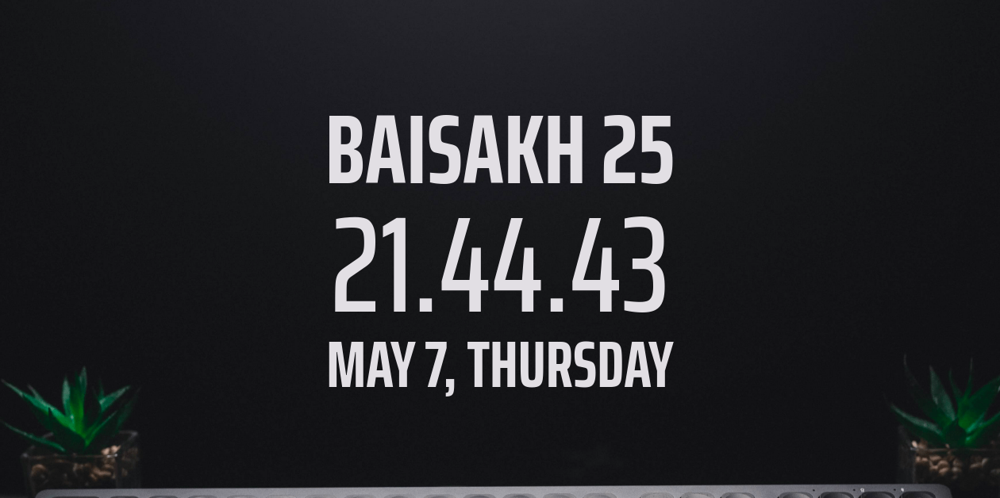

### Whats The Miti ?



A Distractionless Nepali Date & Clock For Your Browser | [See on heroku](https://whatsthemiti.herokuapp.com/)


### API

Just dial `https://whatsthemiti.herokuapp.com/api` to access nepalimiti right in your application.

### Installation

##### This application was tested on python 3.7.

```
python3 -m venv venv
source venv/bin/activate
pip3 install -r requirements.txt
python3 app.py
```
##### After this you're good to access this application in your favourite browser
 
 `http://localhost:5000`

 ##### NOTE: This is a flask implementation rewritten from [old applet.](https://github.com/sidbelbase/nepali-datetime-applet)

## TODOS:

01. [x] Flask Implementation
03. [ ] Chrome Extension
04. [ ] Simple Todos
05. [ ] Firefox Extension
06. [ ] Linux Desktop Widget 
